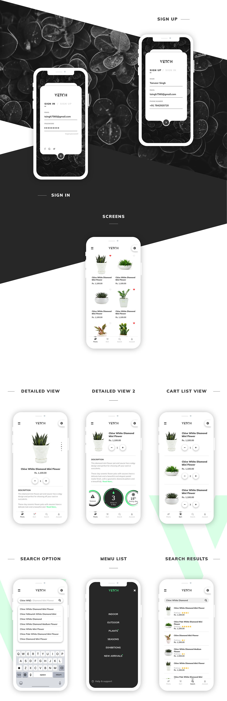

 # 🌱 Flora
 #### Description
 Flora is an app where Users can sell their plants to other people in area
 
 #### Plans 💡​
 In future I want this app to be NY startup. Which may be impossible but future is ours ✨​
 
 ## Tech Stack
* MVVM
* Koin
* Retrofit + Okhttp
* Moshi
* Compose
* Room
* Coroutine jobs
* Firebase
* Coil [instead of Glide]
* Multi module app
* Animations
* Compose navigation

  
 <h3>Desired UI (similar)</h3>

 

